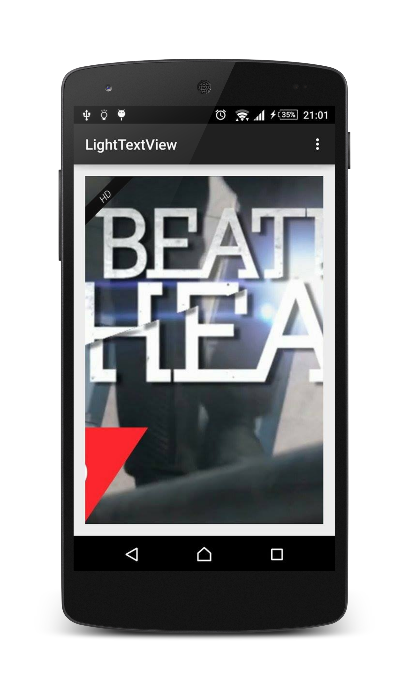

# LightTextView

[](https://android-arsenal.com/details/1/1925)

Easy way to add textview above other views.


# Download

Gradle:

```groovy
compile 'com.neno0o.lighttextview:lib:1.1'
```

Maven:

```xml
<dependency>
  <groupId>com.neno0o.lighttextview</groupId>
  <artifactId>lib</artifactId>
  <version>1.1</version>
  <type>aar</type>
</dependency>
```

# Usage

LightTextView extends `RobotoTextView` which extends `TextView`.

``` java
LightTextView lightTextView = new LightTextView(this);
lightTextView.setText("CLICK");
lightTextView.setBackgroundColor(getResources().getColor(R.color.blue));
lightTextView.setCurrentView(button);
```
setPosition - `LEFT_CORNER` default

``` java
lightTextView.setPosition(LightTextView.Position.RIGHT_CORNER);
```
Customize textfont using RobotoTextView

``` java
Typeface typeface = RobotoTypefaceManager.obtainTypeface(
                getApplicationContext(),
                RobotoTypefaceManager.Typeface.ROBOTO_LIGHT_ITALIC);
RobotoTextViewUtils.setTypeface(lightTextView, typeface);
```

# Thanks to:

+ [RobotoTextView](https://github.com/johnkil/Android-RobotoTextView) 

# License

    Copyright 2015 Neno0o

    Licensed under the Apache License, Version 2.0 (the "License");
    you may not use this file except in compliance with the License.
    You may obtain a copy of the License at
    
       http://www.apache.org/licenses/LICENSE-2.0
    
    Unless required by applicable law or agreed to in writing, software
    distributed under the License is distributed on an "AS IS" BASIS,
    WITHOUT WARRANTIES OR CONDITIONS OF ANY KIND, either express or implied.
    See the License for the specific language governing permissions and
    limitations under the License.
